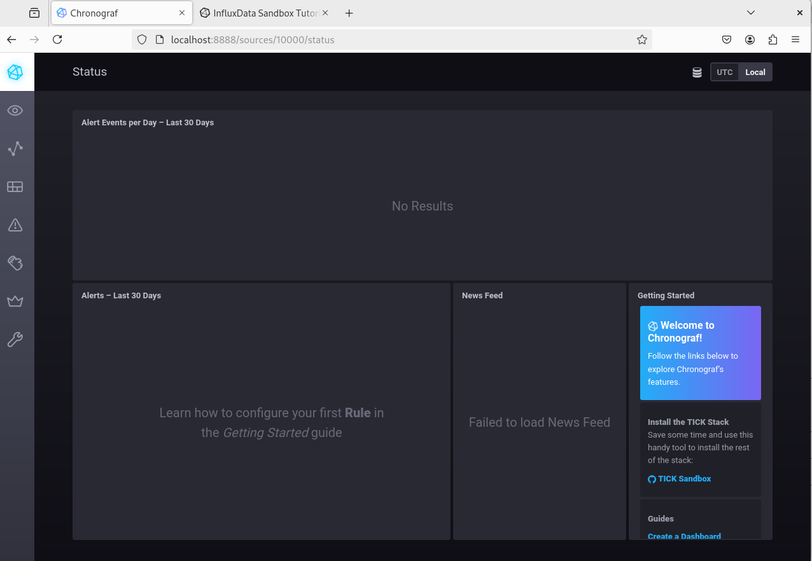
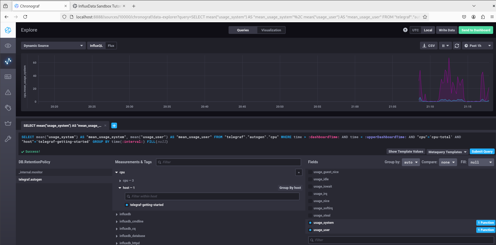
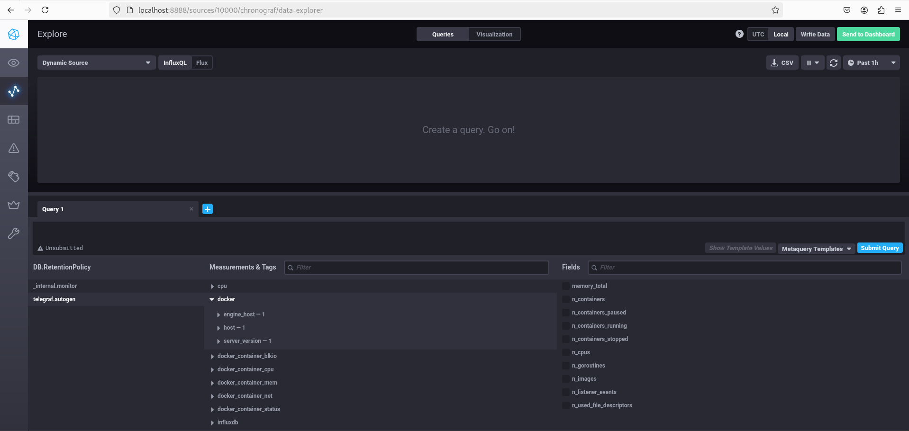

# 01/02. Введение в мониторинг/Системы мониторинга

#### 1. _Вас пригласили настроить мониторинг на проект. На онбординге вам рассказали, что проект представляет из себя платформу для вычислений с выдачей текстовых отчётов, которые сохраняются на диск. Взаимодействие с платформой осуществляется по протоколу http. Также вам отметили, что вычисления загружают ЦПУ. Какой минимальный набор метрик вы выведите в мониторинг и почему?_

Минимальный набор технических метрик примерно такой:
- % загрузки CPU - как индикатор нагрузки на систему
- % использования RAM
- Свободное место на диске - т.к. сервис его активно использует
- Доступные inodes на диске - т.к. можно превысить не только размер, но и допустимое кол-во файлов.
- IOPS - как индикатор скорости/деградации дисковой подсистемы
- мониторинг наличия ответов по http, как простой индикатор работоспособности сервиса в целом.

Дополнительно можно прибавить метрики от сетевого интерфейса, парсинг логов /сбор метрик непосредственно с http-сервера и т.д.

#### 2. _Менеджер продукта, посмотрев на ваши метрики, сказал, что ему непонятно, что такое RAM/inodes/CPUla. Также он сказал, что хочет понимать, насколько мы выполняем свои обязанности перед клиентами и какое качество обслуживания. Что вы можете ему предложить?_

В отчётности для руководства разумнее перейти от технических к индикаторам, рекомедуемым в методололгии SRE, таким как:

- время получения результата от системы (мин/макс/среднее/% запросов, превысивших установаленный допустимый порог и т.д.)
- % ошибок, например по соотношению кодов ответа 5XX/остальных от веб-сервера
- уровень загруженности, например по CPU LA, т.к. у нас вычислительная задача, 
- кол-во запросов, как ещё один индикатор загруженности.

#### 3. _Вашей DevOps-команде в этом году не выделили финансирование на построение системы сбора логов. Разработчики, в свою очередь, хотят видеть все ошибки, которые выдают их приложения. Какое решение вы можете предпринять в этой ситуации, чтобы разработчики получали ошибки приложения?_

Как варианты:
- написать некий скрипт для парсинга логов приложения (они же наверняка, в том или ином виде, есть) по ключевым словам
и совершения неких действий на основе найденного - запуск триггера в системе мониторинга, отправка лога разработчику в почту и т.д. 
- договориться и сформировать выдачу неких метрик/алертов в систему мониторинга (если она есть) прямо из приложения.
- если есть резерв мощностей, и нагрузки позволяют - развернуть временный стенд для сбора логов(ELK/Loki и т.д.) и настроить отбор минимально необходимых данных.

#### 4. _Вы, как опытный SRE, сделали мониторинг, куда вывели отображения выполнения SLA = 99% по http-кодам ответов. Этот параметр вычисляется по формуле: summ_2xx_requests/summ_all_requests. Он не поднимается выше 70%, но при этом в вашей системе нет кодов ответа 5xx и 4xx. Где у вас ошибка?_

В таком варианте к "ошибкам" отнесено множество других кодов ответа, таковыми не являющихся. Например, 3ХХ redirect. 
Лучше считать как all/(4XX+5XX). 

#### 5. _Опишите основные плюсы и минусы pull и push систем мониторинга._
- push-системы: Проще масштабирование/агрегация данных с распределенных систем. Минус - сложность первоначального развёртывания. 
Необходимость индивидуального конфигурирования агентов.
- pull-системы: Плюс - централизованное конфигурирование. Минимальная настройка или вообще отсутствие агентов. 
Минус - сложнее рапликация, агрегирование или наоборот разделение потоков данных.
#### 6. _Какие из ниже перечисленных систем относятся к push модели, а какие к pull? А может есть гибридные?_
 - push: -
 - pull: Prometheus (но есть push-agent), Nagios (традиционный, по факту - гибрид, см."Passive checks" ) 
 - hybrid: Zabbix, TICK, VictoriaMetrics 
Т.е. по факту все системы в той или иной степени "гибридные".

#### 7.

#### 8.
Выводим запрос метрик CPU:

#### 9.
Добавили метрики docker:

