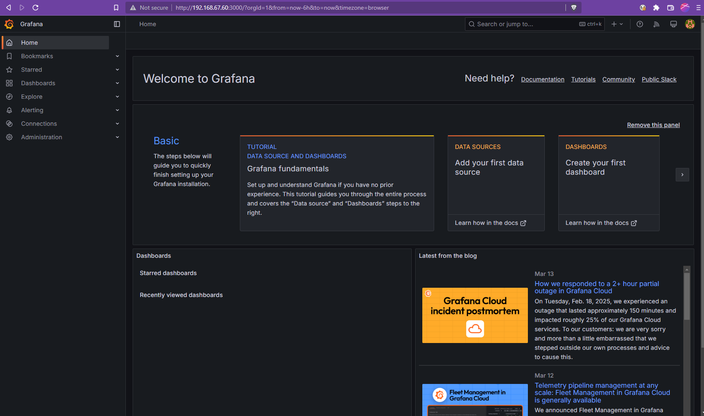
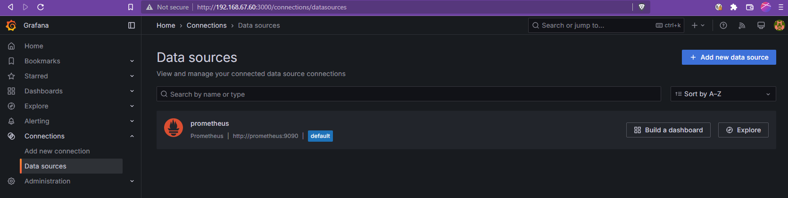
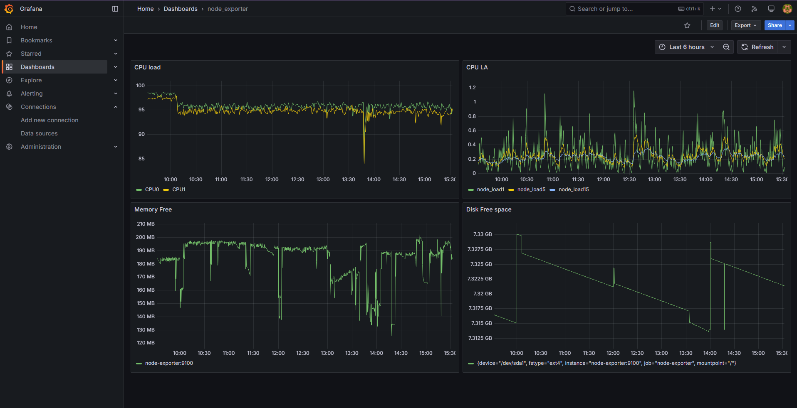
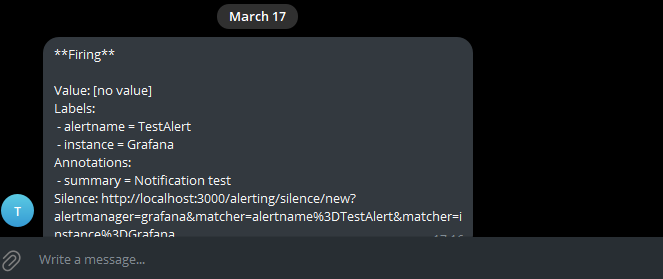
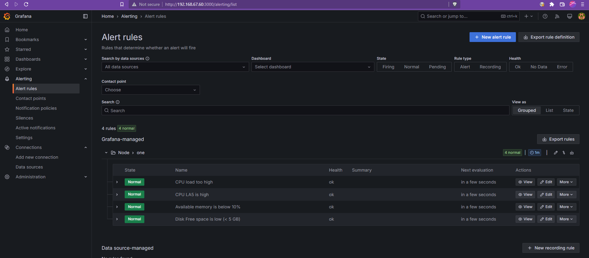
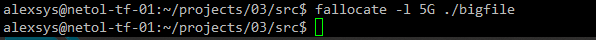
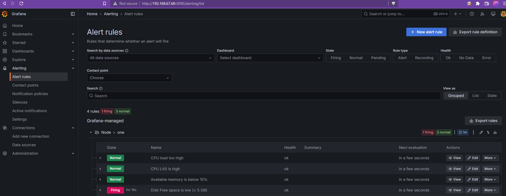
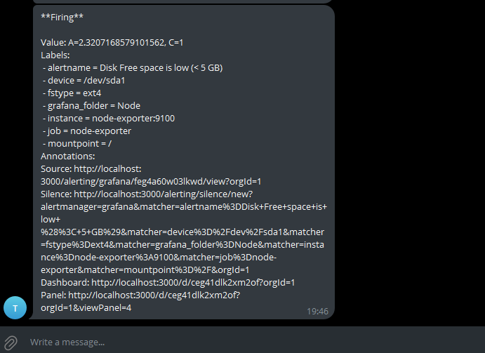

# 03. Средство визуализации Grafana

### 1. Создаём стенд
Создаём [compose file](./src/docker-compose.yml). За основу возьмём набор из репозитория [dockprom](https://github.com/stefanprodan/dockprom/blob/master/docker-compose.yml):

```dockerfile
networks:
  monitor-net:
    driver: bridge

volumes:
    prometheus_data: {}
    grafana_data: {}

services:

  prometheus:
    image: prom/prometheus:v3.1.0
    container_name: prometheus
    volumes:
      - ./prometheus:/etc/prometheus
      - prometheus_data:/prometheus
    command:
      - '--config.file=/etc/prometheus/prometheus.yml'
      - '--storage.tsdb.path=/prometheus'
      - '--storage.tsdb.retention.time=24h'
    restart: unless-stopped
    expose:
      - 9090
    networks:
      - monitor-net

  node-exporter:
    image: prom/node-exporter:v1.8.2
    container_name: node-exporter
    volumes:
      - /proc:/host/proc:ro
      - /sys:/host/sys:ro
      - /:/rootfs:ro
    command:
      - '--path.procfs=/host/proc'
      - '--path.rootfs=/rootfs'
      - '--path.sysfs=/host/sys'
      - '--collector.filesystem.mount-points-exclude=^/(sys|proc|dev|host|etc)($$|/)'
    restart: unless-stopped
    expose:
      - 9100
    networks:
      - monitor-net

  grafana:
    image: grafana/grafana:11.5.1
    container_name: grafana
    volumes:
      - grafana_data:/var/lib/grafana
    environment:
      - GF_SECURITY_ADMIN_USER=${ADMIN_USER:-admin}
      - GF_SECURITY_ADMIN_PASSWORD=${ADMIN_PASSWORD:-admin}
      - GF_USERS_ALLOW_SIGN_UP=false
    restart: unless-stopped
    expose:
      - 3000
    networks:
      - monitor-net

```

В конфигурацию prometheus добавили наш node-exporter:

```yaml
scrape_configs:
  - job_name: 'node-exporter'
    scrape_interval: 5s
    static_configs:
      - targets: ['node-exporter:9100']
```

Запустились:



Добавляем prometheus в источники данных:




### 2. Создаём dashboard
Создали dashboard с 4 панелями, используя метрики 
`node_cpu_seconds_total, node_load, node_memory_MemAvailable_bytes, node_memory_MemTotal_bytes, node_filesystem_free_bytes`.  



### 3. Alerts

Добавим contact point для Telegram:


Тестовое сообщение:



Добавили алерты на CPU, память и свободное место на диске:



Заставим сработать алерт на диск:



Есть:



Сообщение в ТГ:




### 4. Экспорт dashboard
Файл экспорта: 
[Полный](src/Grafana/node_exporter-1742230437545.json)

[Только dashboard](src/Grafana/node_exporter-1742231046430.json)


