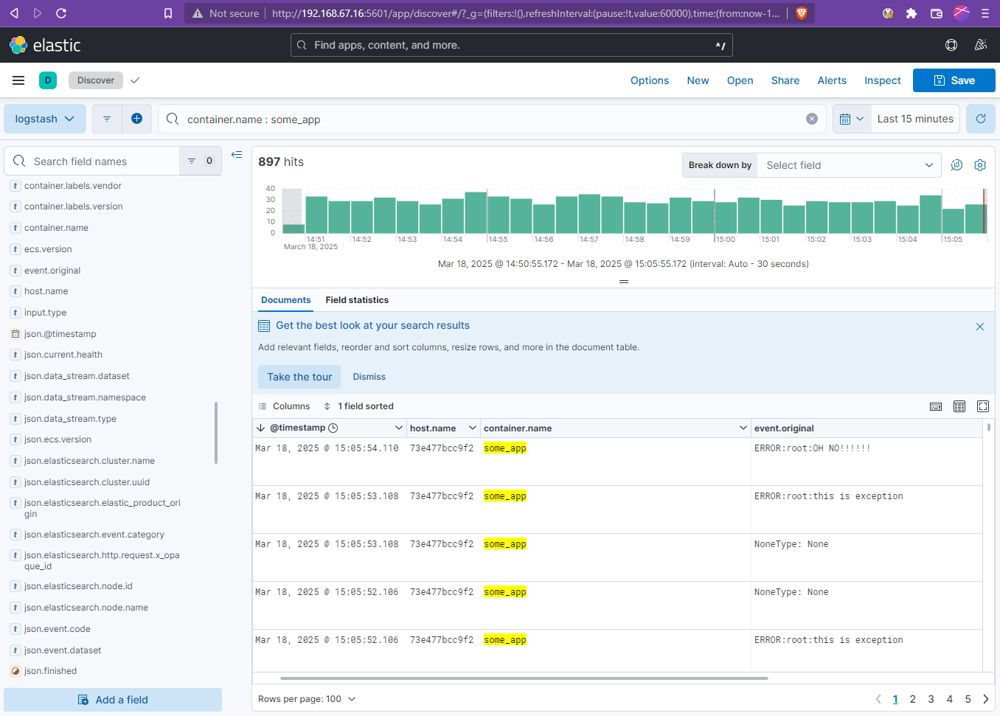

# 04. Система сбора логов Elastic Stack

### 1. Запуск
Создаём ELK-стек с использованием конфигурации из задания, изменив только настройки памяти -Xms2G -Xmx2G java для elasticsearch.
Иначе всё печально. 
При достаточном количестве свободной памяти работает:

Интерфейс Kibana:

### 2. Работа с Kibana

Создаём DataView:

Обзор:

Отфильтровали события от нашего тестового приложения:

