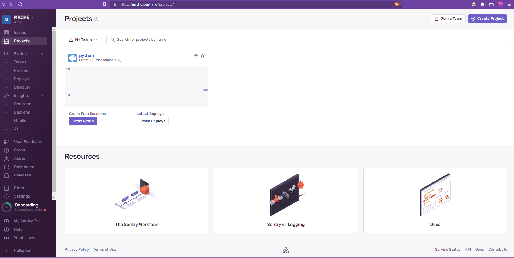
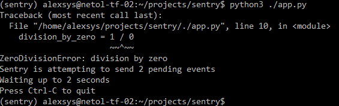
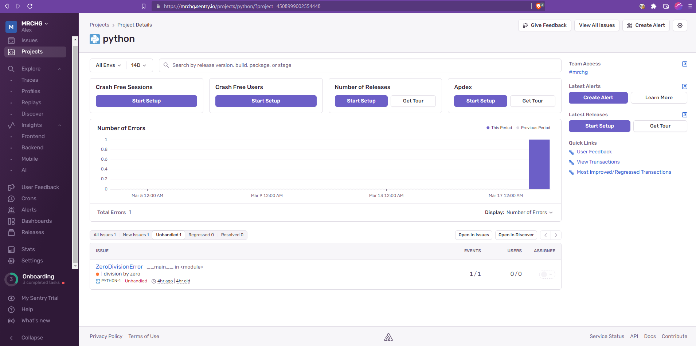
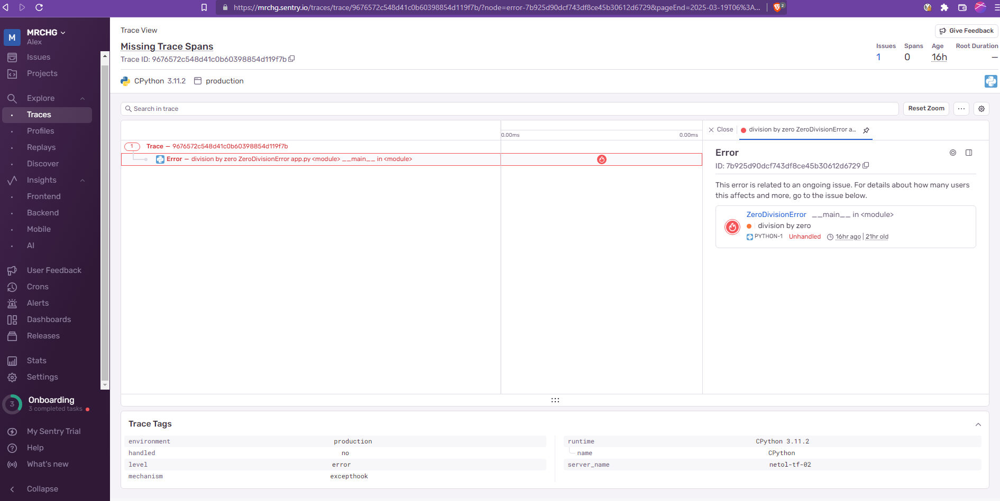
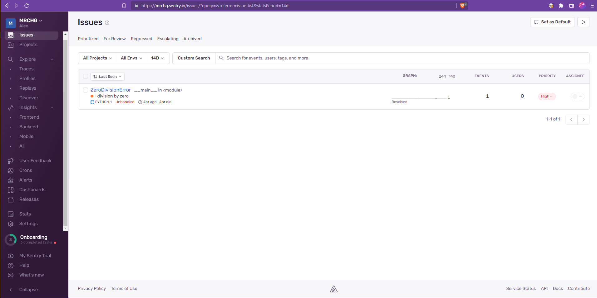
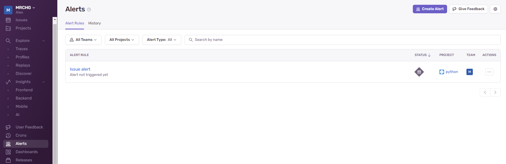
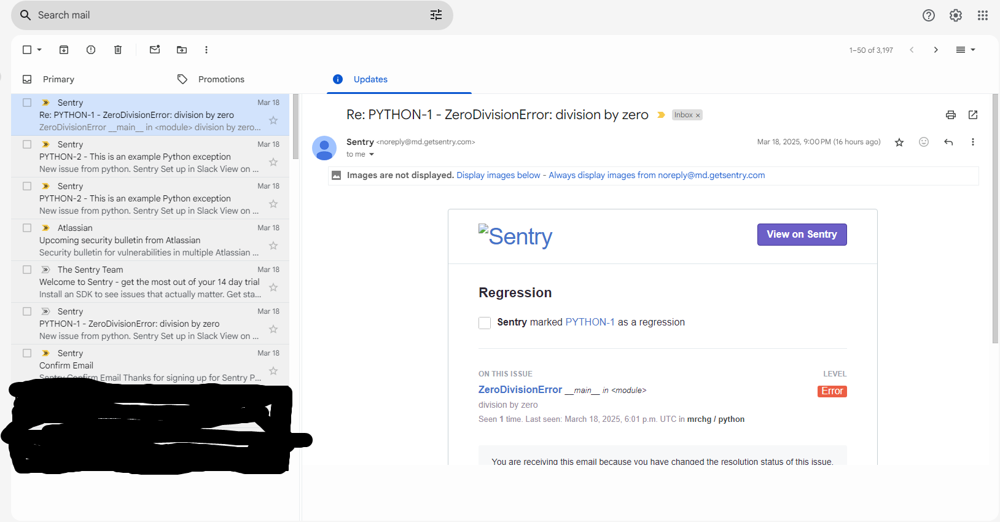

# 5. Платформа мониторинга Sentry

### 1.
Регистрируемся на sentry.io



### 2.

Создали простой python-проект, генерирующий ошибку:

```python
import sentry_sdk

sentry_sdk.init(
    dsn="https://2d83a80dbc2d878a3c1451ca19ecc07e@o4508998993510400.ingest.de.sentry.io/4508999002554448",
    # Add data like request headers and IP for users,
    # see https://docs.sentry.io/platforms/python/data-management/data-collected/ for more info
    send_default_pii=True,
)

division_by_zero = 1 / 0

```

Запустили:



Получили issue:



Trace:



Нажали resolve:



### 3.

Создали alert:



Запустили, получили письмо о регрессе, т.к. сработала та же issue, которая уже resolved:

